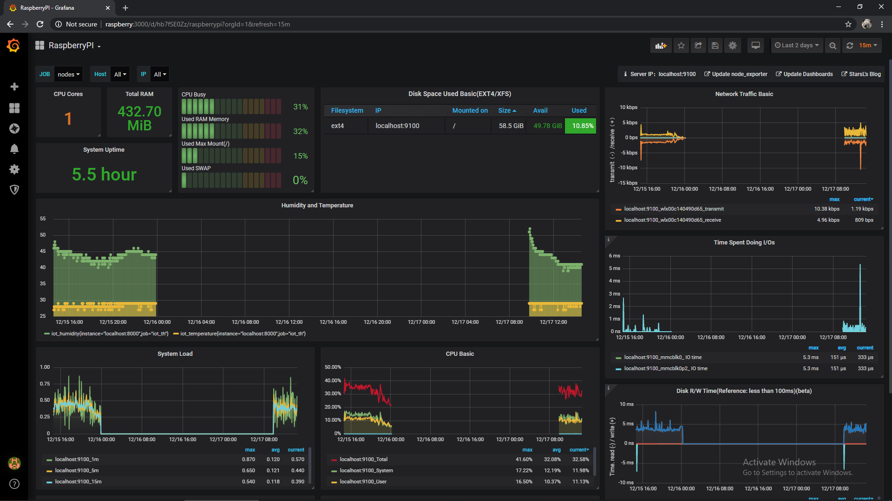
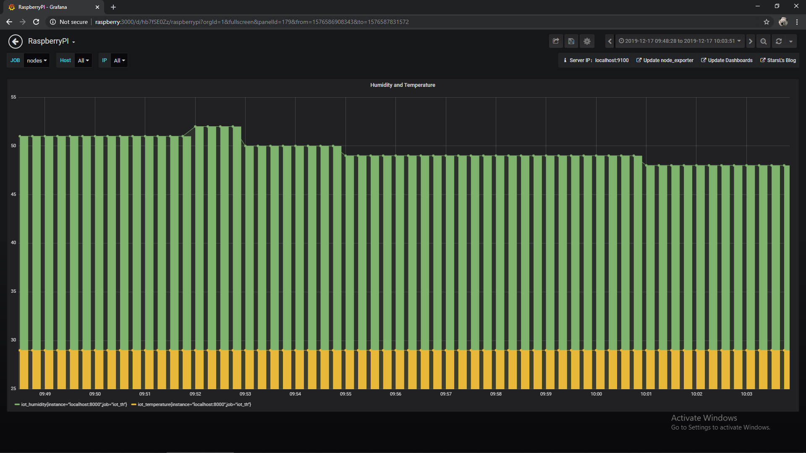

# iot-testing
My little adventure in the IoT world, the idea is to maintain a unique central that controls everything through my Raspberry Pi A+. I'm using the serial communication to fetch the data that I need.

All the data is managed by Prometheus and its exporters and displayed by Grafana. Right now, there is a Arduino Uno plugged into the Raspberry Pi with a DTH11 sensor.

## Hardware
* 1 Raspberry Pi A+
* 1 Arduino Uno
* 1 DTH11 Humidity and Temperature Sensor

## Source code
## [read-temperature-humidity-serial-protocol.ino](read-temperature-humidity-serial-protocol.ino) 

I defined a small and dumb 'protocol' which if Arduino receives a `T` or `H` char, it will respond back with the corresponding value.

## [read.py](read.py)

The python script is the responsible to read the data from Arduino through the serial communication.

#### Python Dependencies
```
pip install pyserial
pip install prometheus_client
```

## Prometheus
I'm using the [prometheus-2.14.0.linux-armv6](https://github.com/prometheus/prometheus/releases/download/v2.14.0/prometheus-2.14.0.linux-armv6.tar.gz) package that was extracted into a folder inside the Raspberry Pi A+.

### [prometheus.yml](prometheus.yml)
```
global:
  scrape_interval:     15s
  evaluation_interval: 15s

alerting:
  alertmanagers:
  - static_configs:
    - targets:
      # - alertmanager:9093

scrape_configs:
  - job_name: 'prometheus'

    static_configs:
    - targets: ['localhost:9090']

  - job_name: 'nodes'
    scrape_interval: 1m
    scrape_timeout: 10s
    static_configs:
     - targets: ['localhost:9100']

  - job_name: 'iot_th'
    scrape_interval: 1m
    scrape_timeout: 10s
    static_configs:
     - targets: ['localhost:8000']
```

### Node Exporter
To fetch node's data I'm using the [node_exporter-0.17.0.linux-armv6](https://github.com/prometheus/node_exporter/releases/download/v0.17.0/node_exporter-0.17.0.linux-armv6.tar.gz) that is installed on Raspberry Pi A+ as well.

## Grafana
The following package has been installed into the Raspberry Pi A+ [grafana-rpi_6.5.2_armhf.deb](https://dl.grafana.com/oss/release/grafana-rpi_6.5.2_armhf.deb) and enabled as a service.

```
wget https://dl.grafana.com/oss/release/grafana-rpi_6.5.2_armhf.deb
sudo dpkg -i grafana-rpi_6.5.2_armhf.deb
sudo systemctl enable grafana-server
sudo systemctl start grafana-server
```

For some reason I had to manage a symbolic link so Raspberry Pi A+ was able to start Grafana during the restarts.

## Visualization


## Humidity & Temperature

